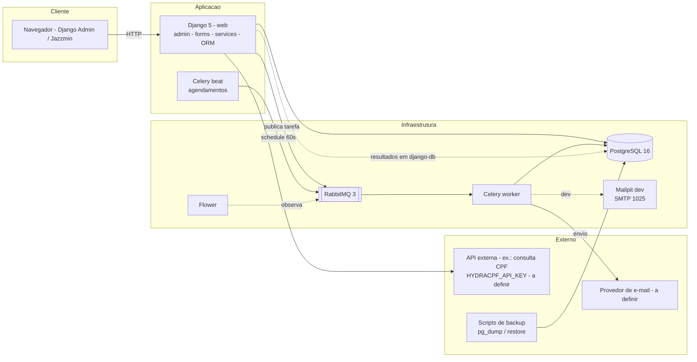
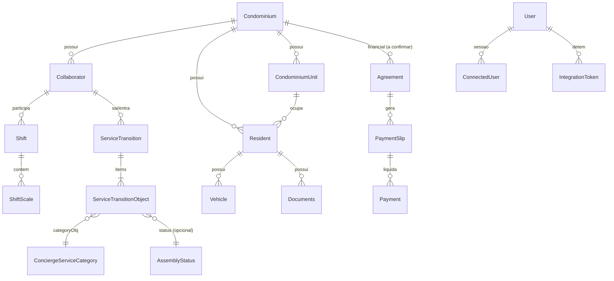

# Brasil Condo — Arquitetura, Estrutura Técnica e Decisões de Engenharia

> Documento vivo. Itens marcados com **[Confirmado]** refletem o estado atual do código;
> **[Hipótese]** são inferências a validar; **[Proposta]** são recomendações de engenharia;
> **[A definir]** indicam pendência de decisão.

## Sumário

1. [Visão geral](#1-visão-geral)
2. [Requisitos](#2-requisitos)
3. [Perfis de usuário e permissões](#3-perfis-de-usuário-e-permissões)
4. [Arquitetura](#4-arquitetura)
5. [Tecnologias e justificativas](#5-tecnologias-e-justificativas)
6. [Estrutura de diretórios](#6-estrutura-de-diretórios)
7. [Domínio e dados](#7-domínio-e-dados)
8. [API e integrações](#8-api-e-integrações)
9. [Segurança e privacidade](#9-segurança-e-privacidade)
10. [Qualidade e testes](#10-qualidade-e-testes)
11. [Execução local e configuração](#11-execução-local-e-configuração)
12. [Deploy e infraestrutura](#12-deploy-e-infraestrutura)
13. [Observabilidade e operação](#13-observabilidade-e-operação)
14. [Padrões de engenharia](#14-padrões-de-engenharia)
15. [Riscos, decisões e perguntas em aberto](#15-riscos-decisões-e-perguntas-em-aberto)
16. [Roadmap técnico inicial](#16-roadmap-técnico-inicial)
17. [Como manter este documento](#17-como-manter-este-documento)

---

## 1. Visão geral

### 1.1 Propósito do Brasil Condo

- **[A definir]** Enunciado oficial do produto (missão em uma frase). Este documento não
  substitui uma declaração validada pelo time de produto.
- **[Hipótese — inferida do código]** O Brasil Condo é um sistema de **gestão de
  condomínios** que centraliza, em um único backoffice web:
  - cadastro de condomínios, unidades, moradores, colaboradores e visitantes;
  - operações de **portaria** (plantões, passagens de serviço, telefones úteis);
  - **reservas** (locações, manutenção, mudanças, reformas);
  - módulo **financeiro** (acordos, boletos, cobranças, pagamentos, rateios, recebimentos);
  - **parâmetros/configurações** e **administração** (votações, atas, e-mails);
  - **gestão de dados** (exportações, backups) e **integrações** (e-mail, comprovantes de CPF).

### 1.2 Problema que o sistema pretende resolve

- **[A definir]** Formulação oficial do problema (validar com produto).
- **[Hipótese]** Administradoras de condomínios e síndicos operam processos fragmentados
  (planilhas, papel na portaria, sistemas isolados por finalidade), com baixa rastreabilidade
  de eventos de portaria e esforço repetido de digitação. O sistema propõe centralizar
  cadastro, operações e registros com **auditoria** (quem criou/alterou, quando) e
  **exportação/backup** dos dados.

### 1.3 Objetivos e limites do projeto

**Objetivos — [Hipótese, a validar]:**

- Oferecer um backoffice único e multi-condomínio para gestão administrativa e operacional.
- Manter trilha de auditoria e capacidade de exportação/backup dos dados.
- Suportar comunicações por e-mail (notificações, votações) de forma assíncrona e confiável.

**Limites (restrições observadas) — [Confirmado]:**

- Interface atual exclusivamente baseada no **Django Admin + Jazzmin** (não há SPA nem app móvel no repositório).
- Não há, no código, API REST, autenticação por token, testes E2E de navegador, nem CI configurado.
- O escopo legal/contratual de funcionalidades (ex.: emissão de boletos, integração bancária)
  não está documentado no repositório — **[A definir]**.

### 1.4 Glossário

| Termo | Significado | Origem |
|---|---|---|
| Condomínio (*tenant* candidato) | Entidade `Condominium` à qual se vinculam unidades, moradores e operações | [Confirmado] |
| Colaborator | Funcionário vinculado ao condomínio (portaria, administrativo) | [Confirmado] |
| Resident | Morador/unidade habitacional | [Confirmado] |
| Plantão (Shift) | Turno de portaria com início/fim e escala associada | [Confirmado] |
| Passagem de Serviço (ServiceTransition) | Registro da troca de turno com lista de objetos | [Confirmado] |
| Escala (ShiftScale) | Item individual de uma escala de plantão | [Confirmado] |
| Parâmetros | Catálogos/lookups de domínio (tipos, estados, categorias, status) | [Confirmado] |
| Usuário conectado | Sessão ativa rastreada por `ConnectedUser` + middleware | [Confirmado] |
| Módulo | App Django em `domains/` entregue de forma incremental (ex.: "02. Passagens de Serviços") | [Confirmado] |

---

## 2. Requisitos

> Não existe, no repositório, documento de requisitos aprovado. Os itens abaixo se apoiam
> no que o código **já implementa** (confirmados) ou em recomendações (propostas).

### 2.1 Requisitos funcionais por domínio

| # | Domínio / app | Requisito | Status |
|---|---|---|---|
| RF-01 | `condominium` | Cadastrar condomínios, tipos, colaboradores e vínculos | [Confirmado] |
| RF-02 | `residents` | Cadastrar moradores, visitantes, veículos, animais, documentos, emergências e unidades | [Confirmado] |
| RF-03 | `gatehouse` | Gerir plantões, escalas e passagens de serviço (com objetos) da portaria | [Confirmado] |
| RF-04 | `parameters` | Manter catálogos paramétricos numerados (25 modelos), administrados pela UI de admin | [Confirmado] |
| RF-05 | `reservations` | Gerir reservas: locações, manutenção, mudanças e reformas | [Confirmado] |
| RF-06 | `financial` | Registrar acordos, boletos, caixa, cobranças, compras, empréstimos, lançamentos, pagamentos, rateios e recebimentos | [Confirmado] |
| RF-07 | `administrative` | Apoiar administração condominial (votações, atas, documentos, reuniões) com e-mails agendados | [Confirmado] (escopo exato a documentar) |
| RF-08 | `data_management` | Exportações e backups (geração assíncrona de arquivos) | [Confirmado] |
| RF-09 | `email_service` | Envio de e-mail com roteamento de provedor, fila interna e processamento | [Confirmado] |
| RF-10 | `system` | Usuários conectados, logs de sistema, suporte técnico, rotinas automatizadas, tokens de integração | [Confirmado] |
| RF-11 | `personalities` | Cadastro de personalidades/perfis auxiliares (escopo a documentar) | [Confirmado] (parcial) |
| RF-12 | Plataforma | Auditoria de criação/atualização (`created_by`, `created_at`, `updated_at`) nos módulos principais | [Confirmado] |
| RF-13 | Plataforma | Exportação de dados e backup/restauração de banco + mídia via scripts | [Confirmado] |

- **[A definir]** Requisitos ainda não refletidos em código (ex.: portal do morador,
  app do síndico, boletos online, regras de rateio, multas, reservas com pagamento).

### 2.2 Requisitos não funcionais

Nenhum foi validado no repositório; itens abaixo são **[Proposta]**, exceto onde indicado:

| Área | Proposta | Status |
|---|---|---|
| Segurança | Senhas com validadores Django, HTTPS em produção, CSRF ativo, gestão de segredos por variáveis de ambiente (padrão já usado — [Confirmado]) | Parcialmente [Confirmado] |
| Desempenho | `select_related`/`prefetch_related` em listagens críticas (padrão já adotado — [Confirmado]); metas de tempo de resposta **[A definir]** | Parcialmente [Confirmado] |
| Disponibilidade | SLA/uptime **[A definir]**; atualmente composição única, sem redundância | [A definir] |
| Escalabilidade | Workers Celery horizontais por fila **[Proposta]**; dimensionamento **[A definir]** | [Proposta] |
| Acessibilidade | Padrão WCAG AA **[Proposta]**; nada mensurado hoje | [Proposta] |
| Manutenibilidade | Testes automatizados (ex.: 812 passando — [Confirmado]), convenções de código e ADRs **[Proposta]** | Parcialmente [Confirmado] |
| Idioma/fuso | `LANGUAGE_CODE=pt-br`, `TIME_ZONE=America/Sao_Paulo` | [Confirmado] |

### 2.3 Premissas, restrições e pendências

- **[Confirmado]** Pré-requisito: Docker/Compose para execução; variáveis em `dotenv_files/.env`.
- **[Confirmado]** Dependências majoritariamente **sem pin de versão** (exceto Django/psycopg2) — risco de build não reprodutível.
- **[A definir]** Requisitos legais (LGPD, guarda de imagens, prazos), requisitos de
  desempenho e volume (número de condomínios, usuários, registros).
- **[A definir]** Existência de um backlog/protótipo de produto que embase prioridades.

---

## 3. Perfis de usuário e permissões

### 3.1 Perfis plausíveis **[Hipótese — a validar]**

| Perfil | Descrição |
|---|---|
| Administrador da plataforma | Sustenta a instalação, parâmetros globais e usuários |
| Administradora / Síndico | Gestão completa do condomínio (financeiro, reservas, cadastros) |
| Portaria / Funcionário | Plantões, passagens de serviço, visitantes |
| Morador | Consulta de reservas, unidades, comunicados (portal **[A definir]**) |
| Prestador/Fornecedor | Acesso restrito a serviços e agendas **[A definir]** |

### 3.2 Matriz de permissões inicial **[Hipótese]**

| Módulo | Adm. plataforma | Síndico/Admin. | Portaria | Morador |
|---|---|---|---|---|
| Parâmetros globais | CRUD | Leitura | — | — |
| Condomínio/moradores | CRUD | CRUD | Leitura (moradores) | Dados próprios |
| Portaria (plantões/passagens) | CRUD | CRUD | CRUD | — |
| Reservas | CRUD | CRUD | Leitura | Solicitar/consultar **[A definir]** |
| Financeiro | CRUD | CRUD | — | Extrato próprio **[A definir]** |
| Gestão de dados/backup | Executar | Exportar | — | — |
| Sistema (logs/usuários conectados) | CRUD | Leitura | — | — |

> Hoje o sistema opera com **staff/superusuário do Django + Groups** [Confirmado];
> a matriz acima é alvo, não estado atual.

### 3.3 Implementação no Django **[Proposta]**

- **Modelo de usuário:** `AUTH_USER_MODEL` **não está customizado** [Confirmado] — usar
  `django.contrib.auth` + perfis por **Group** e permissões por módulo (`Permission`/`Meta.permissions`).
- **Escopo por condomínio:** além do CRUD, aplicar filtro automático de condicional de
  pertencimento nas querysets (ver §4.5) — permissão por *tenant* e permissão por módulo são camadas distintas.
- **Admin vs. aplicação:** enquanto a UI for o Django Admin [Confirmado], `ModelAdmin.has_*_permission`
  e `get_queryset` são os pontos de controle; futura UI própria exigirá política centralizada
  (ex.: Django Guardian ou regras em serviço) **[Proposta]**.
- **Admin-only modules:** vários módulos de `parameters` são entregues sem views/URLs próprias
  (apenas Django Admin) [Confirmado] — registrar essa decisão em ADR ao evoluir.

---

## 4. Arquitetura

### 4.1 Componentes e responsabilidades

| Componente | Responsabilidade | Status |
|---|---|---|
| Navegador (cliente) | Acesso ao backoffice via Django Admin (Jazzmin) | [Confirmado] |
| App Django (`web`) | Views/admin, forms, services, validações, ORM | [Confirmado] |
| PostgreSQL 16 | Banco transacional de dados | [Confirmado] |
| RabbitMQ | Broker de mensagens (tarefas Celery) | [Confirmado] |
| Celery worker | Execução assíncrona (e-mails, exportações) | [Confirmado] |
| Celery beat | Agendamento (varredura de e-mails de votações, 60s) | [Confirmado] |
| Flower | Monitoramento de tarefas (dev) | [Confirmado] |
| Mailpit | Captura de e-mail de desenvolvimento (SMTP :1025) | [Confirmado] |
| Scripts `scripts/` | Backup (`pg_dump`) e restauração; `command.sh` (boot do container) | [Confirmado] |
| `shared/` e `infrastructure/` | Camada transversal: repositories, selectors, services, validators; adaptadores (e-mail, storage, logging, SMS, WhatsApp) | [Confirmado] (estrutura); `sms`/`whatsapp` vazios **[Proposta]** como adapters futuros |

### 4.2 Fluxo síntese

1. **Requisição síncrona:** navegador → Django (admin/forms/services) → ORM → PostgreSQL → resposta HTML.
2. **Fluxo assíncrono:** service enfileira tarefa (`@shared_task`) → RabbitMQ → worker Celery
   → e-mail/exportação → resultado persistido em `django_celery_results` (backend `django-db`).
3. **Agendamento:** Celery beat dispara varredura periódica → publica no broker → worker executa.

### 4.3 Diagrama de arquitetura



### 4.4 Tarefas assíncronas: quando usar e como falhar

**[Proposta]** Usar Celery quando a operação: (a) ultrapassa ~200 ms; (b) depende de
I/O externo (SMTP, APIs); (c) gera arquivos pesados (exportações/relatórios); ou (d)
precisa de agendamento/reexecução.

Estado atual **[Confirmado]**:

- Tarefas existentes: `email_service` (2), `administrative.virtual_meeting_email_tasks` (3),
  `data_management.export_tasks` (1+); todas com `bind=True, max_retries=3` onde aplicável.
- Serialização JSON; result backend `django-db`; beat com uma tarefa a cada 60 s.

**[Proposta]** para falhas:

| Tema | Recomendação |
|---|---|
| Retentativas | `autoretry_for` + backoff exponencial + `retry_jitter`; limite de tentativas explícito |
| Idempotência | Toda tarefa deve ser reexecutável com segurança (chave de idempotência ou verificação de estado antes de agir) — **crítico para e-mails** |
| Dead-letter | Configurar DLX no RabbitMQ e alerta para tarefas esgotadas **[Proposta]** |
| Prioridades | Filas separadas (`email`, `export`, `default`) **[Proposta]** — hoje é fila única **[Confirmado]** |
| Timeouts | `soft`/`time limit` por tarefa (hoje há timeouts configuráveis apenas para export/backup via env **[Confirmado]** — generalizar **[Proposta]**) |
| Visibilidade | Resultados em `django_celery_results` + Flower **[Confirmado]** |

### 4.5 Isolamento entre condomínios (multi-tenancy)

**Estado atual — [Confirmado]:**

- Vínculo `condominium` (FK) existe em `administrative` (9 arquivos de modelos), `residents` (9),
  `gatehouse`, `data_management`, `email_service`; **não observado** em `financial`/`reservations`
  (modelo de acesso financeiro por condomínio **a esclarecer**).
- **Não há** middleware de tenant, nem `Router` de banco, nem Row-Level Security no PostgreSQL.

**Alternativas (a decidir — [A definir]):**

| Opção | Prós | Contras |
|---|---|---|
| A) FK + filtro em service/queryset | Simples; alinha com código atual | Falha humana filtra esquecida; exige disciplina |
| B) Middleware + `threading.local`/contextvar + manager padrão | Filtro automático | Aumenta complexidade; cuidado com tasks Celery (sem request) |
| C) Schema por condomínio | Isolamento forte | Migraciones e operação muito mais caras |
| D) RLS no PostgreSQL | Isolamento no banco | Integração com ORM exige cuidado (`SET app.current_tenant`) |

**[Proposta]** se houver apenas poucos condomínios por instância: opção **B + testes de vazamento**;
se houver exigência de isolamento forte por cliente: avaliar **D**. Decisão depende do modelo
de negócio (SaaS multitenante vs. instalação por condomínio) — **pergunta em aberto (Q-02)**.

---

## 5. Tecnologias e justificativas

| Tecnologia | Papel | Versão | Status |
|---|---|---|---|
| Python | Linguagem | 3.12 (container) | [Confirmado] |
| Django | Framework web/admin/ORM | 5.0.3 | [Confirmado] |
| PostgreSQL | Banco de dados | 16 | [Confirmado] |
| psycopg2 | Driver PG | 2.9.9 | [Confirmado] |
| RabbitMQ | Broker | `rabbitmq:3-management` | [Confirmado] |
| Celery | Processo assíncrono | sem pin **[A definir]** | [Confirmado] (uso) |
| django-celery-results | Resultado das tarefas em BD | sem pin | [Confirmado] |
| django-jazzmin | Tema/admin UI (tema `darkly`) | sem pin | [Confirmado] |
| django-ckeditor | Editor rico | sem pin | [Confirmado] |
| Docker/Compose | Ambiente e orquestração local | — | [Confirmado] |
| Flower | Monitoramento Celery | imagem `mher/flower` | [Confirmado] (dev) |
| Mailpit | SMTP de desenvolvimento | `axllent/mailpit` | [Confirmado] (dev) |
| Pillow / requests / cryptography | Imagens, HTTP, criptografia | sem pin | [Confirmado] |
| pytest + pytest-django | Testes | uso atual **[Confirmado]** (não listado em `requirements.txt` **[A definir]**) |
| gunicorn/uvicorn | Servidor WSGI/ASGI em produção | — | **[A definir]** (hoje `runserver` no Compose **[Confirmado]** para dev) |
| nginx/etc. | Proxy estático/TLS | — | **[A definir]** |
| DRF/FastAPI | API programática | — | **[A definir]** (ver §8) |
| Redis | Cache/broker alternativo | — | **[A definir]** (não usado hoje) |

**Alternativas relevantes (quando a decisão depender dos requisitos):**

- **Broker:** RabbitMQ (atual) vs. Redis (mais simples) vs. SQS (gerenciado) — depende de
  infraestrutura alvo **[A definir]**.
- **Admin UI:** Django Admin+Jazzmin (atual) vs. front próprio — custo/benefício vs. requisitos de UX **[A definir]**.
- **Banco:** PostgreSQL único vs. particionamento futuro (volume de dados **[A definir]**).

---

## 6. Estrutura de diretórios

### 6.1 Árvore atual (simplificada) **[Confirmado]**

```text
djangoProject/
├── manage.py
├── pytest.ini                  # DJANGO_SETTINGS_MODULE=project.settings_test
├── requirements.txt            # dependências (majoritariamente sem pin)
├── docker-compose.yml          # web, db, rabbitmq, celery_worker, celery_beat, flower, mailpit
├── Dockerfile
├── dotenv_files/.env           # variáveis de ambiente (sem segredos no repositório)
├── project/                    # settings, urls, celery.py, wsgi/asgi
├── core/                       # app core (CoreConfig)
├── domains/                    # apps de negócio (DDD leve)
│   ├── administrative/         # administração condominial (votações, e-mails, docs)
│   ├── condominium/            # Condominium, Collaborator, TypesCollaborator
│   ├── data_management/        # exportações e backups
│   ├── email_service/          # roteamento/fila de e-mail
│   ├── financial/              # 11 modelos (Acordo, Boleto, Pagamento, Rateio, ...)
│   ├── gatehouse/              # portaria (Shift, ShiftScale, ServiceTransition, ...)
│   ├── parameters/             # 25 catálogos paramétricos
│   ├── personalities/          # cadastro auxiliar
│   ├── reservations/           # Rentals, Maintenance, Move, Reforms
│   ├── residents/              # Resident, Visitor, Vehicle, Animal, Documents, ...
│   └── system/                 # ConnectedUser, SystemLog, suporte, tokens, middleware
├── shared/                     # camada transversal
│   ├── repositories/           # acesso a dados transversal
│   ├── selectors/              # leituras/consultas
│   ├── services/               # regras de negócio transversais
│   ├── validators/ exceptions/ constants/ utils/
├── infrastructure/             # adaptadores (celery, email, logging, sms, storage, whatsapp)
├── scripts/                    # command.sh, backup.sh, restore.sh, backup_engine.py
├── templates/                  # templates de topo (admin/parameters/system)
├── static_collected/           # collectstatic
├── backups/, data/, media/     # dados e artefatos (volumes)
└── tests…                      # testes por domínio (domains/*/tests)
```

### 6.2 Responsabilidades e convenções observadas

- **`domains/<app>/`** segue padrão interno **[Confirmado]**: `models/`, `forms.py`, `admin.py`,
  `services/`, `repositories/`, `selectors/`, `validators/`, `middleware/`, `dto/`, `tests/`,
  `migrations/`, `static/`.
- **`shared/`** concentra o que é usado por mais de um domínio; **`infrastructure/`** isola
  detalhes de I/O externo (hoje majoritariamente esqueleto — preencher conforme adotar **[Proposta]**).
- Convenções de código identificadas **[Confirmado]**: `verbose_name` numerado
  (ex.: `02. Passagens de Serviços`), campos em `camelCase` no app `gatehouse`, auditoria em
  `snake_case`, services com `@transaction.atomic` + logging estruturado + `ValueError` de domínio.

### 6.3 Sugestões de evolução (não são decisões)

> Blocos a seguir são **[Proposta]**, não estrutura atual:

```text
docs/
├── adr/            # Architecture Decision Records (ADR-0001, ...)
└── runbooks/
api/ ou domains/<app>/api/   # se houver API (§8)
.github/workflows/           # CI/CD (§12)
```

**Módulos de negócio ainda não criados** (exemplos, a validar): portal do morador,
notificações, cobrança online — **não** devem ser tratados como comprometidos.

---

## 7. Domínio e dados

### 7.1 Entidades candidatas **[Confirmado como código / hipótese como modelo de negócio]**

| Entidade | App | Observação |
|---|---|---|
| `Condominium`, `Collaborator`, `TypesCollaborator` | condominium | Núcleo do vínculo por condomínio |
| `Resident`, `Visitor`, `Vehicle`, `Animal`, `Documents`, `Emergency`, `RealEstateAgency`, `CondominiumUnit` | residents | Dados de moradores/unidades |
| `Shift`, `ShiftScale`, `ServiceTransition`, `ServiceTransitionObject`, `UsefulPhoneNumber` | gatehouse | Portaria |
| `AssemblyStatus`, `ConciergeServiceCategory` + ~23 catálogos | parameters | Lookups numerados |
| `Agreement`, `PaymentSlip`, `Cash`, `Collection`, `Shopping`, `Loan`, `NewRelease`, `Payment`, `Apportionment`, `Receipt` | financial | Financeiro |
| `Rentals`, `MaintenanceReservations`, `MoveReservations`, `Reforms` | reservations | Reservas |
| `ConnectedUser`, `SystemLog`, `IntegrationToken`, `TechnicalSupportTicket`, `AutomatedRoutine`, `Training` | system | Plataforma |
| E-mail (fila/ provedor) | email_service | Modelos de fila/rotas |

### 7.2 Relacionamentos importantes **[Confirmado]**

- `Condominium` 1–N `Collaborator`, `Resident`, `CondominiumUnit` e registros operacionais (via FK).
- `ServiceTransition` 1–N `ServiceTransitionObject` (`related_name="items"`), com
  `UniqueConstraint` (condomínio, colaborador saída, colaborador entrada, data).
- `Shift` 1–N `ShiftScale`; status de escala/assembleia reutiliza `AssemblyStatus`.
- `ServiceTransitionObject.categoryObj` → `parameters.ConciergeServiceCategory` (FK).
- Usuários do sistema: `django.contrib.auth.User` (sem `AUTH_USER_MODEL` customizado) ligado a
  `ConnectedUser` e `created_by` de registros auditados.

### 7.3 Diagrama ER simplificado

> Somente entidades já existentes no código; relacionamentos **simplificados** para leitura.
> Cardinalidades e nomes exatos devem ser conferidos no modelo antes de uso decisório.



### 7.4 Práticas de dados **[Proposta]**

- **Migrações:** sempre por `makemigrations` versionado; revisar diff em PR; nunca editar
  migração já aplicada em ambiente compartilhado; manter reversibilidade quando viável;
  para mudança de dado grande, usar `RunPython` com lote e janela de manutenção.
- **Integridade referencial:** `on_delete` explícito em todo FK (padrão já observado **[Confirmado]**);
  evitar `SET_NULL` em dados operacionais sem política de exceção.
- **Índices:** índices para chaves de busca/filtro (ex.: `idx_svctrans_release_date` **[Confirmado]**);
  revisar `pg_stat_statements` para candidatos.
- **Auditoria:** campos `created_by/created_at/updated_at` **[Confirmado]**; considerar
  `django-simple-history` ou tabela de eventos **[Proposta]** para mudanças críticas (financeiro).
- **Retenção:** política por categoria (dados pessoais vs. operacionais) **[A definir]** (ver §9).

---

## 8. API e integrações

### 8.1 Estratégia de API **[A definir]**

- Hoje **não existe API HTTP** no repositório **[Confirmado]** (sem DRF, sem rotas de API).
- **[Proposta]** Se houver necessidade (portal do morador, app, integrações B2B):
  - **REST com Django REST Framework** (mesmo ORM/serializadores) — prós: ecossistema, admin
    compatível; contras: superfície a manter.
  - Alternativa: **GraphQL** (mais flexível, complexidade maior) ou **mantê-la interna** (sem API pública).

### 8.2 Recomendações (caso a API exista) **[Proposta]**

| Tema | Recomendação |
|---|---|
| Autenticação | Token (JWT ou `rest_framework.authtoken`) + sessão para o admin; MFA **[A definir]** |
| Autorização | Mesma matriz de permissões do §3, aplicada por serializer/view |
| Versionamento | Prefixo `/api/v1/` + política de depreciação |
| Paginação | Paginação por offset com limit máximo; filtros via querystring |
| Validação | Reaproveitar `forms`/`services`/`validators` existentes (fonte única de regra) |
| Erros | Formato consistente (`{"detail": ..., "code": ...}`), códigos HTTP corretos, requestId |
| Limites | Throttling por usuário/IP |

**Exemplo de endpoints (PROVISÓRIO — meramente ilustrativo):**

```http
GET    /api/v1/condominiums/
GET    /api/v1/residents/?condominium={id}
POST   /api/v1/gatehouse/service-transitions/
GET    /api/v1/gatehouse/service-transitions/{id}/
```

### 8.3 Integrações externas

| Integração | Evidência | Status |
|---|---|---|
| E-mail (SMTP) | `EMAIL_*` + `email_service` (roteador/fila) + Mailpit em dev | [Confirmado] |
| Consulta de CPF | Variável `HYDRACPF_API_KEY` presente no `.env` | [Confirmado] (fornecedor/contrato **[A definir]**; não expor chave) |
| SMS / WhatsApp | Pastas `infrastructure/sms`, `infrastructure/whatsapp` vazias | [Proposta] / [A definir] |
| Boletos/PSP/bancos | Módulo `financial` existe; provedor **não identificado** | [A definir] |
| Mapas/geolocalização, assinatura digital, ERP contábil | — | [A definir] |

---

## 9. Segurança e privacidade

> Itens abaixo são **[Proposta]** salvo indicação contrária. Nada aqui declara conformidade
> legal garantida.

### 9.1 Segurança da aplicação

- **Autenticação:** senhas com validadores Django **[Confirmado]**; sessões com expiração
  **[A definir]**; MFA para administradores **[Proposta]**.
- **Autorização:** matriz do §3; revisar `has_*_permission` em todo `ModelAdmin` **[Proposta]**.
- **Segredos:** variáveis de ambiente via `dotenv_files/.env` **[Confirmado]**; nunca commitar
  segredos; rotacionar `SECRET_KEY`/senhas **[Proposta]**; scanner de segredos em CI **[Proposta]**.
- **Criptografia:** HTTPS obrigatório em produção **[Proposta]**; dados sensíveis (tokens de
  integração) com criptografia em repouso — `cryptography` já é dependência **[Confirmado]**;
  chaves fora do banco **[Proposta]**.
- **Proteção contra ataques:** CSRF **[Confirmado]**, `SECURITY_MIDDLEWARE` **[Confirmado]**,
  headers (HSTS/CSP/X-Frame) **[A definir]**, rate limiting de login **[Proposta]**,
  proteção contra SQLi (ORM) **[Confirmado por uso de ORM]**, uploads validados (Pillow/CKEditor) **[Proposta]**.
- **Auditoria:** `created_by/at` **[Confirmado]**; `SystemLog` existe **[Confirmado]** —
  definir retenção e imutabilidade **[A definir]**.

### 9.2 LGPD (avaliação necessária — **não** é conformidade garantida)

| Tema | Situação | Ação |
|---|---|---|
| Minimização de dados | Cadastramos moradores, documentos, veículos, animais **[Confirmado]** | Inventário de dados pessoais **[A definir]** |
| Finalidade e base legal | Não documentada | Definir com jurídico/produto **[A definir]** |
| Retenção e eliminação | Sem política observada | Política por categoria + rotina de expurgo **[A definir]** |
| Direitos do titulares (ACESSO/ELIMINAÇÃO) | Sem fluxo observado | Playbook de atendimento **[A definir]** |
| Controle de acesso | Staff/admin + groups **[Confirmado]**; mapeamento por dado pessoal **[Proposta]** | Revisar por módulo |
| Operadores/terceiros | Provedor de e-mail, API de CPF, hospedagem **[A definir]** | Mapear e registrar |
| Registro de incidentes | `SystemLog` existe **[Confirmado]** | Definir processo de resposta **[A definir]** |

---

## 10. Qualidade e testes

### 10.1 Pirâmide de testes **[Proposta]**

| Nível | Escopo | Ferramenta proposta | Estado atual |
|---|---|---|---|
| Unitário | Services, validators, forms, widgets | pytest + pytest-django (`@pytest.mark.django_db`) | [Confirmado] (812 testes passando; 1 falha conhecida e pré-existente em `system/test_connected_users`) |
| Integração | ORM + services + Celery (eager) | pytest + fábricas/fixtures | [Confirmado] parcial |
| API | Endpoints REST | pytest + APIClient (se API existir) | N/A (sem API) |
| E2E | Fluxos críticos no admin | Playwright/Selenium **[Proposta]** | Não existente |
| Lint/formato | Padrão de código | Ruff ou Flake8 + Black **[Proposta]** | Não configurado |

### 10.2 Configuração atual de testes **[Confirmado]**

- `pytest.ini` → `DJANGO_SETTINGS_MODULE=project.settings_test` (SQLite, `ALLOWED_HOSTS=*`,
  Celery em modo eager com broker `memory://`).
- Padrão de arquivos: `domains/<app>/tests/test_<modulo>_<camada>.py`.
- Conhecida falha: `domains/system/tests/test_connected_users.py::test_connected_user_admin_is_read_only`
  (comportamento pré-existente, não regressão recente).

### 10.3 Revisão de código e cobertura **[Proposta]**

- PRs obrigatórios; 1 revisor; checklist: testes novos, migração revisada, sem segredos,
  docs/ADRs atualizados quando houver decisão.
- CI: `ruff` + `pytest` + `makemigrations --check` + `manage.py check`.
- Cobertura: inicial 70% em serviços/validators (meta a calibrar) — **[A definir]**.

### 10.4 Dados de teste e ambientes **[Proposta]**

- Fixtures por domínio (padrão atual com `conftest.py` **[Confirmado]**); migrar para
  `factory_boy` **[Proposta]** se volume crescer.
- Dados de homologação sintéticos (não produção) **[Proposta]**; anonimizar dados pessoais
  ao copiar de produção **[Proposta]**.

---

## 11. Execução local e configuração

### 11.1 Pré-requisitos **[Confirmado]**

- Docker + Docker Compose.
- Arquivo `dotenv_files/.env` com as variáveis abaixo (**sem valores/segredos neste documento**).

### 11.2 Variáveis de ambiente (nomes) **[Confirmado]**

```bash
# Django
SECRET_KEY=            # obrigatório em produção; não versionar valor
DEBUG=
ALLOWED_HOSTS=

# PostgreSQL
POSTGRES_DB=
POSTGRES_USER=
POSTGRES_PASSWORD=
POSTGRES_HOST=
POSTGRES_PORT=

# Celery
CELERY_BROKER_URL=
CELERY_RESULT_BACKEND= # ex.: django-db

# E-mail
EMAIL_PROVIDER=        # ex.: smtp
EMAIL_BACKEND=
EMAIL_HOST=
EMAIL_PORT=
EMAIL_USE_TLS=
EMAIL_USE_SSL=
EMAIL_HOST_USER=
EMAIL_HOST_PASSWORD=
DEFAULT_FROM_EMAIL=
SERVER_EMAIL=

# Integrações (exemplo)
HYDRACPF_API_KEY=      # não expor

# Operação (nomes já usados pelo código)
CONNECTED_USER_TIMEOUT=
BACKUP_SCRIPT_PATH=
BACKUP_RESTORE_SCRIPT_PATH=
EXPORT_ROOT=
```

### 11.3 Execução com Docker Compose **[Confirmado] (comandos EXEMPLO)**

```bash
# subir toda a stack (web, db, rabbitmq, workers, beat, flower, mailpit)
docker compose up --build

# aplicar migrações
docker compose exec web python manage.py migrate

# criar superusuário (interativo)
docker compose exec web python manage.py createsuperuser

# coletar arquivos estáticos
docker compose exec web python manage.py collectstatic --noinput

# logs de um serviço
docker compose logs -f celery_worker
```

```bash
# testes (execução local com venv, usa SQLite de teste)
pytest domains -q
```

Pontos de acesso típicos em desenvolvimento **[Confirmado]**: app `:8000`, RabbitMQ UI `:15672`,
Flower `:5555`, Mailpit `:8025`.

### 11.4 Docker Compose **[Proposta]**

O compose atual já orquestra os serviços necessários **[Confirmado]**; melhorias sugeridas:
healthchecks (`pg_isready`, `rabbitmq-diagnostics`), perfil `dev` vs `prod`, e remoção de
credenciais default do Flower (`guest@rabbitmq`) em ambientes compartilhados **[Proposta]**.

---

## 12. Deploy e infraestrutura

### 12.1 Ambientes

| Ambiente | Finalidade | Status |
|---|---|---|
| Desenvolvimento | Docker Compose local (web, db, rabbitmq, workers, Mailpit) | [Confirmado] |
| Homologação | Espelho da produção para validação | **[A definir]** (não existe no repositório) |
| Produção | Uso real | **[A definir]** (provedor, hospedagem, topologia) |

### 12.2 Pipeline CI/CD **[Proposta]**

```yaml
# exemplo ilustrativo (não implementado)
stages:
  - lint      # ruff check / format --check
  - test      # pytest + manage.py check + makemigrations --check
  - build     # docker build
  - deploy-homologacao   # manual/promoção
  - deploy-producao       # manual com aprovação
```

- **Migrações na publicação:** rodar `manage.py migrate --plan` antes; aplicar em janela;
  nunca reverter migration aplicada em produção sem ADR — preferir **forward fix**.
- **Rollback:** rollback de código + reexecução de migração reversível quando existir;
  manter compatibilidade de esquema por uma versão (expand/contract) **[Proposta]**.
- **Backups:** `scripts/backup.sh` usa `pg_dump` **[Confirmado]**; propor backup incremental
  de mídia, retenção (ex.: 30 dias) e **restauração testada** em cron periódico **[Proposta]**.
- **Provedor de nuvem, IaC, CDN, WAF:** **[A definir]**.

---

## 13. Observabilidade e operação

### 13.1 Logs **[Confirmado parcial / Proposta]**

- Logging configurado em `settings.py` **[Confirmado]**; services usam logging estruturado em
  mensagens **[Confirmado]**.
- **[Proposta]** formato JSON com `request_id`/usuário/tenant; envio a plataforma central
  (ELK/Loki/Cloud) **[A definir]**.

### 13.2 Métricas e tracing **[Proposta]**

- Expor métricas (django-prometheus ou statsd): latência HTTP, erros 5xx, fila, tarefas.
- **[A definir]** tracing distribuído (OpenTelemetry) — relevante apenas se houver API/serviços extras.

### 13.3 Monitoramento Celery/RabbitMQ **[Proposta]**

| Sinal | Alerta sugerido |
|---|---|
| Profundidade da fila (`RabbitMQ` management API) | > N mensagens por X min |
| Tarefas FAILED em `django_celery_results` | qualquer FAILED em fila crítica |
| Tarefas pendentes (PENDING/RETRY) antigas | idade > SLA da tarefa |
| Workers vivos | 0 workers heartbeating |
| Beat atrasado | última execução > 2× intervalo |
| Espaço em disco (`data/`, backups) | < 20% livre |

### 13.4 Saúde, incidentes e suporte **[Proposta]**

- Endpoint `/health/` (DB + broker) para balanceador **[Proposta]**.
- Runbooks: restauração de backup (**script existe [Confirmado]**; runbook **[A definir]**),
  fila travada, reprocessamento de e-mails.
- Suporte: `TechnicalSupportTicket` existe no módulo `system` **[Confirmado]** — definir SLA **[A definir]**.

---

## 14. Padrões de engenharia

### 14.1 Código e organização por domínio **[Confirmado na prática / Proposta ao formalizar]**

- Um app Django por domínio em `domains/`; regra de negócio **não** em views/admin — fica em
  `services/` com transação (`@transaction.atomic`), validação explícita (`validators/`) e
  erros de domínio (`exceptions/`).
- Camadas: `views/admin → forms → services → repositories → ORM`; leituras podem usar `selectors/`.
- Convenções identificadas: `verbose_name` numerado por módulo; campos `camelDomínio` no
  `gatehouse`; testes por módulo/camada.

### 14.2 Dependências e versionamento **[Proposta]**

- Fixar versões (hoje só Django/psycopg2 estão fixados **[Confirmado]**): gerar `requirements.txt`
  com `pip freeze` ou adotar `pip-tools`/`poetry` **[A definir]**.
- Commits/branches: Conventional Commits + Git Flow simplificado (main + feature) **[Proposta]**;
  histórico atual é direto na principal **[Confirmado]**.

### 14.3 Revisão de pull requests **[Proposta]**

- PR pequeno (<400 linhas diff), descrição com o *porquê*, checklist (testes, migração,
  segurança, docs), aprovação obrigatória para módulos financeiros/autenticação.

### 14.4 Documentação e ADRs **[Proposta]**

- `project.md` (este) para visão geral; ADRs curtos em `docs/adr/` para decisões
  (ex.: "ADR-001: isolation multi-tenant", "ADR-002: admin-only em parameters").
- Atualizar este documento em toda decisão que altere arquitetura, stack ou requisitos.

---

## 15. Riscos, decisões e perguntas em aberto

### 15.1 Riscos

| # | Risco | Tipo | Mitigação proposta |
|---|---|---|---|
| R-01 | Dependências sem pin → builds não reprodutíveis | Técnico | Fixar versões + lockfile |
| R-02 | Isolamento por condomínio não garantido (sem mecanismo automático) | Segurança/Dados | Decidir estratégia (§4.5) + testes de vazamento |
| R-03 | Sem CI → regressões silenciosas | Processo | Pipeline mínimo (lint+testes) |
| R-04 | Falha conhecida de teste (`connected_users`) pode mascarar regressões | Qualidade | Corrigir ou marcar explicitamente como xfail |
| R-05 | Tarefas de e-mail não idempotentes → envios duplicados | Operacional | Chave de idempotência + deduplicação |
| R-06 | Backups sem verificação periódica de restauração | Operacional | Restauração de teste em ambiente descartável |
| R-07 | Segredos/credenciais default (ex.: Flower `guest`) fora de dev | Segurança | Credenciais por ambiente + rotação |
| R-08 | LGPD sem inventário/política de retenção | Jurídico | Avaliação com jurídico + inventário de dados |
| R-09 | Django Admin como única UI → limites de UX/escala de perfis | Produto | Decidir evolução de UI |
| R-10 | Módulo financeiro sem integração definida | Escopo | Validar escopo de pagamentos/boletos |

### 15.2 Decisões já confirmadas **[Confirmado]**

1. Stack base: Django 5.0.3 + PostgreSQL 16 + RabbitMQ + Celery + Django Admin/Jazzmin.
2. Organização por domínios em `domains/` com camadas services/repositories/shared.
3. Comunicação assíncrona via Celery (`@shared_task`), resultados em `django-db`, beat para rotinas.
4. Execução local padronizada em Docker Compose, configuração por `.env`.
5. Testes automatizados com pytest e settings de teste dedicados (SQLite).
6. Backup/restauração por scripts shell com `pg_dump`.
7. Interface atual restrita ao admin (módulos `parameters` entregues admin-only).

### 15.3 Hipóteses **[Hipótese]**

1. Objetivo/problema do produto (seção 1) conforme inferido do código.
2. Perfis de usuário e matriz de permissões (seção 3).
3. Operação multi-condomínio em única instância (SaaS ou on-prem por condomínio).

### 15.4 Decisões pendentes **[A definir]**

1. Estratégia de multi-tenancy (§4.5).
2. Necessidade e formato de API (§8).
3. Provedor de nuvem e topologia de produção (§12).
4. Provedor de boletos/PAGAMENTOS e de SMS/WhatsApp.
5. Política de retenção/dados LGPD (§9).
6. Servidor de aplicação em produção (gunicorn/uvicorn + proxy).
7. Ferramentas de CI/CD e de observabilidade.

### 15.5 Perguntas objetivas

**Para produto:**

- Q-01 Qual é o enunciado oficial de objetivo e problema do Brasil Condo?
- Q-02 O produto é multitenante (vários condomínios na mesma instância) ou uma instância por condomínio?
- Q-03 Quais perfis de usuário existem de fato e o que cada um acessa?
- Q-04 Há previsão de portal/app do morador? Em que prazo/ordem de prioridade?
- Q-05 O módulo financeiro precisa emitir boletos/Pix/assinatura de contratos? Com qual provedor?
- Q-06 Quais integrações são obrigatórias na primeira versão (e-mail, CPF, outros)?
- Q-07 Quais requisitos legais se aplicam (LGPD, guarda de contratos, imagens de câmeras)?

**Para engenharia:**

- Q-08 Qual a meta de desempenho e volume (condomínios, usuários simultâneos, registros)?
- Q-09 Qual o alvo de deploy e quem opera (equipe própria/terceiros)?
- Q-10 Devemos fixar todas as dependências e introduzir lockfile agora?
- Q-11 Adotamos CI mínima (lint+testes) nesta fase? Qual ferramenta?
- Q-12 A falha conhecida em `test_connected_user_admin_is_read_only` será corrigida ou marcada como xfail?
- Q-13 Existe apetite para API REST nesta fase ou apenas admin?

---

## 16. Roadmap técnico inicial

> Fases sem prazos; ordem sugere dependência lógica. **[Proposta]**

| Fase | Entregas | Depende de |
|---|---|---|
| **F0 — Fundação técnica** | Fixar dependências + lockfile; CI mínima (lint+testes+`makemigrations --check`); corrigir/xfail da falha conhecida; healthcheck | — |
| **F1 — Segurança e dados** | Decisão de multi-tenancy (Q-02) e testes de vazamento; inventário LGPD; política de backup/restauração testada; headers HTTPS/CSP | F0 |
| **F2 — Operação** | Logs JSON + alertas de fila/tarefas Celery; backups automatizados com verificação; runbooks; ambiente de homologação | F0 |
| **F3 — Funcionalidades prioritárias** | Prioridades definidas por produto (Q-04/Q-05): ex. evolução de portaria, reservas, financeiro | Q-01..Q-06 |
| **F4 — Evolução de interface/API** | Se validado: API (DRF) + autenticação por token; portal do morador; acessibilidade do admin | F1, Q-13 |
| **F5 — Escala e qualidade contínua** | Fila com DLX/filas por prioridade; cobertura alvo; E2E dos fluxos críticos; métricas de latência | F2, F3 |

---

## 17. Como manter este documento

- **Responsabilidade compartilhada:** quem implementa a mudança atualiza o `project.md` no mesmo PR.
- **Gatilhos obrigatórios de atualização:** nova dependência/stack; decisão de arquitetura (criar ADR associado);
  novo módulo de negócio; mudança em permissões, segurança ou compliance; alteração em deploy/observabilidade.
- **Revisão:** ao menos a cada milestone; validar seções **[Hipótese]**/**[A definir]** com produto/engenharia
  e movê-las para **[Confirmado]** apenas com evidência (código, decisão registrada ou testes).
- **Status:** nunca remover marcas de status; ao confirmar, trocar a marca e referenciar a data/ADR.
- **Segredos:** este documento não deve conter credenciais, chaves ou tokens — somente nomes de variáveis.
- **Versionamento:** versionar no Git; mudanças relevantes descritas na mensagem do commit
  (ex.: `docs: atualiza seção de multi-tenancy`).
